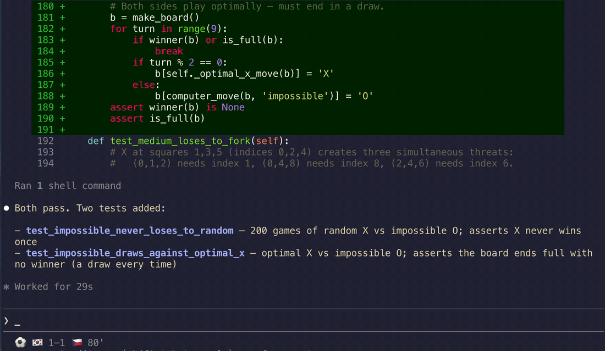
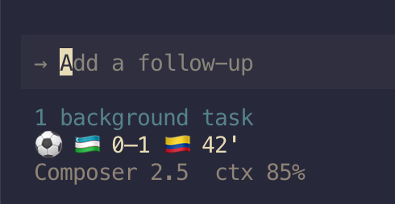

# Claudinho ⚽

[](https://github.com/arturogarrido/claudinho/actions/workflows/ci.yml)
[](https://www.npmjs.com/package/@claudinho/cli)
[](https://www.npmjs.com/package/@claudinho/mcp)
[](https://cursor.directory/plugins/claudinho)
[](https://nodejs.org)
[](LICENSE)
[](https://github.com/arturogarrido/claudinho)

**Live scores for the 2026 men's football tournament — in your terminal, your Claude Code / Cursor CLI statusline, and any MCP client.** No API key, no signup; all 104 fixtures ship bundled, so the schedule works offline.

<p align="center">
  
</p>
<!-- HERO: real live-match capture from the Jun 11 opener — the statusline flips to
     South Korea's 81st-minute winner (1–1 → 2–1) while pytest runs. -->

```bash
npx @claudinho/cli today      # try it in 10 seconds — no install, no key
npx @claudinho/cli live       # what's on right now (during match windows)
```

While matches are live, your Claude Code or Cursor CLI statusline reads:

```text
⚽ 🇳🇴 1–1 🇫🇷 87' · 🇸🇳 1–2 🇮🇶 86'
```

And `claudinho share` prints a card made for the group chat:

<!-- DEMO CARD: verbatim output of `claudinho share table A`. Chosen over a single
     match card because it has no fixed date to go stale (a played-and-passed fixture
     reads as abandoned). Standings still drift across matchdays — REGENERATE
     periodically, especially before any conversion-sensitive moment. Never hand-edit. -->
```text
Group A · standings

1. 🇲🇽 MEX  6 pts · 2-0-0 · +3
2. 🇰🇷 KOR  3 pts · 1-0-1 · 0
3. 🇨🇿 CZE  1 pts · 0-1-1 · -1
4. 🇿🇦 RSA  1 pts · 0-1-1 · -2

Live data: ESPN
#VibingLaVidaLoca · Independent fan project · not affiliated with FIFA or Anthropic.
Try it: npx @claudinho/cli table A
```

> ⚠️ **Not affiliated with, endorsed by, or connected to FIFA or Anthropic.**
> Claudinho is an independent, open-source fan project. It displays factual match data
> (scores, fixtures, standings) and uses emoji flags only — no logos, emblems, kits,
> broadcast footage, or player likenesses.

## Install

### Just the CLI

```bash
npm i -g @claudinho/cli
claudinho today
claudinho next MEX --tz America/Mexico_City --lang es
```

### Cursor CLI — statusline + MCP

One command wires the live-score statusline and prints the MCP config to paste:

```bash
npm i -g @claudinho/cli
claudinho init cursor          # statusline → ~/.cursor/cli-config.json (+ the MCP paste)
```

<p align="center">
  
</p>

Restart your agent session to see it. Prefer to paste it yourself? `claudinho init cursor --print`
emits the snippets, or copy them straight from here:

**Statusline** — `~/.cursor/cli-config.json`:
```json
{
  "statusLine": {
    "type": "command",
    "command": "claudinho prompt",
    "padding": 0,
    "updateIntervalMs": 1000,
    "timeoutMs": 1500
  }
}
```

**MCP tools** — `~/.cursor/mcp.json` (global) or a project `.cursor/mcp.json`:
```json
{ "mcpServers": { "claudinho": { "command": "npx", "args": ["-y", "@claudinho/mcp"] } } }
```

**Optional env** — a model + context line below the score, or scope to your team:
```bash
export CLAUDINHO_CURSOR_META=auto   # model + context % line under the score (recommended)
export CLAUDINHO_TEAM=MEX           # show only your team's match
export CLAUDINHO_FLAGS=off          # 3-letter codes instead of flag emoji (already automatic in Warp)
```

> **Note:** Cursor's `beforeSubmitPrompt` hook doesn't yet reliably inject context into the
> model, so the score-aware *hook* stays Claude Code-only for now — the statusline and MCP
> server work great in Cursor.

### Claude Code — statusline, score-aware hook, MCP

```bash
npm i -g @claudinho/cli
claudinho init claude          # statusline + live-score hook, then the MCP one-liner
```

`init claude` backs up `~/.claude/settings.json` first and is idempotent. Prefer the pieces
à la carte? Run `init-statusline`, `init-hook`, and:

```bash
claude mcp add claudinho -- npx -y @claudinho/mcp
```

Restart Claude Code to activate.

> **Monorepo / local dev?** The `init cursor` / `init claude` aliases wire the global
> `claudinho`. To point a statusline or hook at a local build, use the granular commands
> with `--command`, e.g. `claudinho init-cursor-statusline --command "node ./packages/cli/dist/index.js prompt"`
> (and `init-statusline` / `init-hook` for Claude Code).

### Other MCP clients — Codex, Claude Desktop, Windsurf, Zed, VS Code

```bash
codex mcp add claudinho -- npx -y @claudinho/mcp    # Codex CLI
```

Everything else takes the standard stdio config:

```json
{ "mcpServers": { "claudinho": { "command": "npx", "args": ["-y", "@claudinho/mcp"] } } }
```

## Surfaces

- **CLI** — `today`, `live`, `next MEX`, `table`, `match <id>`, `bracket`, `markets`, `share` (and `vibe` 😎). `--json` on everything; TZ-aware via `--tz`.
- **Live statusline — Claude Code & Cursor CLI** — every live score inline; reads a local micro-cache, never blocks on the network. One command per agent: `claudinho init claude` / `claudinho init cursor` (also tmux & Starship via `claudinho prompt`).
- **Score-aware hook (Claude Code)** — a `UserPromptSubmit` hook that drops the live score into the model's context during matches; zero tokens off-match. (Cursor parity pending — its hook can't reliably inject context yet.)
- **MCP server** — 8 read-only tools (`get_today`, `get_live`, `get_match`, `get_next_fixture`, `get_standings`, `get_bracket`, `get_market_signal`, `get_share_snippet`) plus `my_team` / `tournament_today` prompts.
- **Prediction-market signals** — a read-only "who's favored" line (market-implied percentages, Source: Polymarket), shown only when a reliable market exists. **Informational only — not betting advice.** Opt out: `--no-markets` / `CLAUDINHO_MARKETS=off`.
- **Shareable cards** — `claudinho share next MEX --copy` puts a plain-text match card on your clipboard; `claudinho share table A` does the same for a group's live standings; `claudinho share bracket` for the knockout tree.

Speaks `en` / `es` / `pt` / `fr`, with optional localized commentary flair (`¡GOOOOL!`) — dial it down with `--flavor subtle|off`.

_Planned (not shipped yet):_ a desktop notifier and an AI pundit with a public accuracy scorecard.

## FAQ

**Do I need an API key or account?** No. Nothing to sign up for; `npx` and done.

**Does it work offline?** The schedule, `next`, group skeletons, and knockout bracket structure do — all 104 fixtures are bundled. Only live scores hit the network.

**Where does the data come from?** Live scores from ESPN's public scoreboard (attributed in output as `Live data: ESPN`); market signals from Polymarket public data. Rate limits respected.

**Is the market line betting advice?** No. It's read-only, informational-only market data with attribution — no trading, no links — and it never appears on the statusline or hook.

**Why no crests, kits, or player photos?** Legal-clean by design: facts and emoji flags only.

**Flags show as boxed letters (`CH`, `BA`)?** Some terminals — notably Warp — don't compose
the regional-indicator pairs into flag glyphs, so 🇨🇭 renders as a boxed `CH`. claudinho
auto-detects Warp and drops the flags: **3-letter codes on the statusline** (`MEX 1–0 RSA 67'`)
and **plain team names in the hook**, `today` / `live` / `table`, and `next`. Force it anywhere with `CLAUDINHO_FLAGS=off`, or keep flags
with `CLAUDINHO_FLAGS=on`.

**Windows?** Works, but flag emoji rendering varies by terminal — best on macOS/Linux. See the
flags note above; `CLAUDINHO_FLAGS=off` gives clean codes on any terminal that can't render them.

## License

MIT © 2026 Arturo Garrido. All three packages publish with npm provenance via OIDC trusted publishing.

---

_Built while watching the games._ **#VibingLaVidaLoca** ⚽
