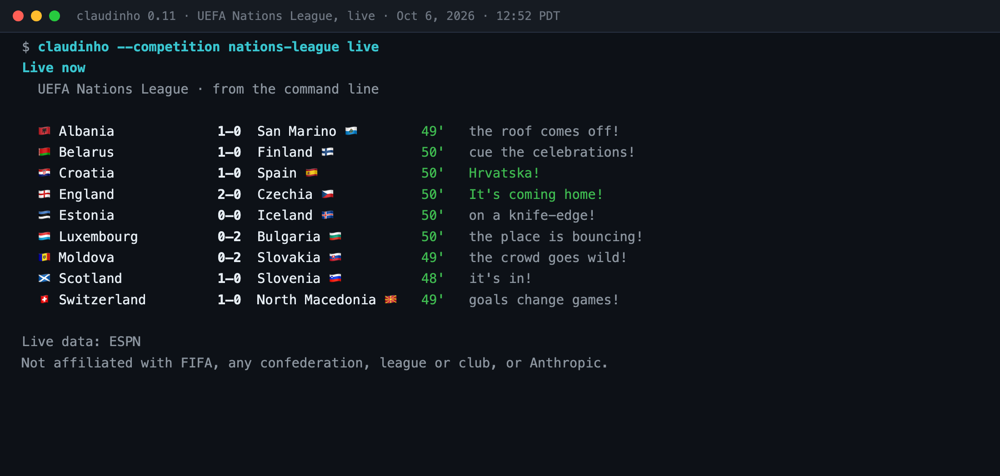
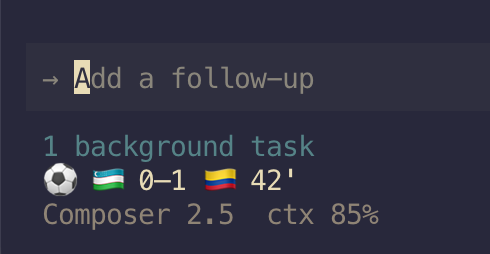
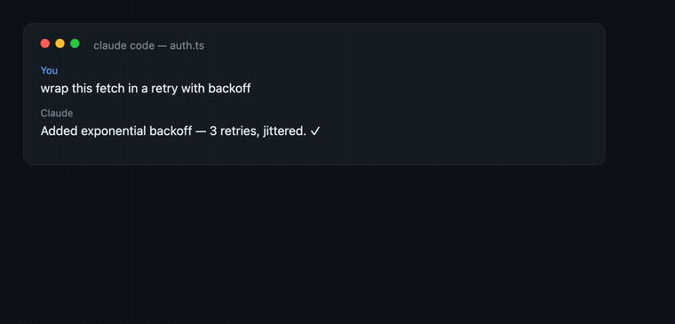

# Claudinho ⚽

[](https://github.com/arturogarrido/claudinho/actions/workflows/ci.yml)
[](https://www.npmjs.com/package/@claudinho/cli)
[](https://www.npmjs.com/package/@claudinho/mcp)
[](https://www.npmjs.com/package/@claudinho/cli)
[](https://cursor.directory/plugins/claudinho)
[](https://smithery.ai/servers/arturogarrido/claudinho)
[](https://glama.ai/mcp/servers/arturogarrido/claudinho)
[](https://nodejs.org)
[](LICENSE)
[](https://github.com/arturogarrido/claudinho)
[](https://github.com/arturogarrido/claudinho)

**Live football scores, fixtures and standings for the competition you follow (the World Cup, the Premier League, LALIGA, the Champions League and 11 more) in your terminal, your Claude Code and Cursor CLI statusline, and MCP clients.** No API key, no signup. The World Cup's 104 fixtures ship bundled; the other competitions' schedules are read from the feed. It ran the 2026 World Cup from the opener to the final.

<p align="center">
  
</p>
<!-- HERO: a real capture, `claudinho --competition nations-league live` on Oct 6, 2026, the
     second half of the UEFA Nations League's 11:45 PDT batch (nine matches in play) and
     the first matchday 0.11 ran. Not a recording: the command's real output at that moment,
     rendered to a PNG. -->

```bash
npx @claudinho/cli follow nations-league   # choose a competition once (follow --list shows them all)
npx @claudinho/cli today      # try it in 10 seconds — no install, no key
npx @claudinho/cli live       # what's on right now (during match windows)
```

> ⭐ **Like it?** [Star the repo](https://github.com/arturogarrido/claudinho): a fan project's only scoreboard is its stars. (`claudinho star` shows you how anytime.)

While matches are live, your Claude Code or Cursor CLI statusline reads (the same moment as the capture above, eight matches shown and one counted):

```text
⚽ 🇦🇱 1–0 🇸🇲 49' · 🇧🇾 1–0 🇫🇮 50' · 🇭🇷 1–0 🇪🇸 50' · 🏴󠁧󠁢󠁥󠁮󠁧󠁿 2–0 🇨🇿 50' · 🇪🇪 0–0 🇮🇸 50' · 🇱🇺 0–2 🇧🇬 50' · 🇲🇩 0–2 🇸🇰 49' · 🏴󠁧󠁢󠁳󠁣󠁴󠁿 1–0 🇸🇮 48' +1
```

And `claudinho share` prints a card made for the group chat:

<!-- DEMO CARD: verbatim output of `claudinho --competition world-cup --tz UTC share table A`.
     Chosen over a single match card because it has no fixed date to go stale (a
     played-and-passed fixture reads as abandoned). Standings still drift across
     matchdays: REGENERATE periodically, especially before any conversion-sensitive
     moment. Never hand-edit. Re-rendered on 2026-10-05 (0.11) through the CLI's own
     `share table A` command, offline: a provider double served the capture's Group A
     rows, at a frozen clock of 2026-06-28T12:00Z. -->
```text
World Cup · standings

Group A · standings

1. 🇲🇽 MEX  9 pts · 3-0-0 · +6
2. 🇿🇦 RSA  4 pts · 1-1-1 · -1
3. 🇰🇷 KOR  3 pts · 1-0-2 · -1
4. 🇨🇿 CZE  1 pts · 0-1-2 · -4

Live data: ESPN
#VibingLaVidaLoca · Independent fan project · Not affiliated with FIFA, any confederation, league or club, or Anthropic.
Try it: npx @claudinho/cli --competition world-cup table A
```

> ⚠️ **Not affiliated with FIFA, any confederation, league or club, or Anthropic. Nor endorsed by or connected to any of them.**
> Claudinho is an independent, open-source fan project. It displays factual match data
> (scores, fixtures, standings) and uses emoji flags only: no logos, emblems, kits,
> broadcast footage, or player likenesses.

## Install

### Just the CLI

```bash
npm i -g @claudinho/cli
claudinho follow world-cup     # choose once: every command, the statusline and the hook follow it
claudinho today
claudinho next MEX --tz America/Mexico_City --lang es
```

### Cursor CLI: statusline + MCP

One command wires the live-score statusline and prints the MCP config to paste:

```bash
npm i -g @claudinho/cli
claudinho init cursor          # statusline → ~/.cursor/cli-config.json (+ the MCP paste)
```

<p align="center">
  
</p>
<p align="center"><sub>Captured during the 2026 World Cup group stage.</sub></p>

Restart your agent session to see it. Prefer to paste it yourself? `claudinho init cursor --print`
emits the snippets, or copy them straight from here:

**Statusline**, in `~/.cursor/cli-config.json`:
```json
{
  "statusLine": {
    "type": "command",
    "command": "claudinho prompt",
    "padding": 0,
    "updateIntervalMs": 1000,
    "timeoutMs": 1500
  }
}
```

**MCP tools**, in `~/.cursor/mcp.json` (global) or a project `.cursor/mcp.json`:
```json
{ "mcpServers": { "claudinho": { "command": "npx", "args": ["-y", "@claudinho/mcp"] } } }
```

**Optional env**: a model + context line below the score, or scope to your team:
```bash
export CLAUDINHO_CURSOR_META=auto   # model + context % line under the score (recommended)
export CLAUDINHO_TEAM=MEX           # your team's match first (the others counted); or pin one: claudinho follow <alias> --team <name>
export CLAUDINHO_FLAGS=off          # 3-letter codes instead of flag emoji (already automatic in Warp)
export CLAUDINHO_DEBUG=1            # print data-provider failure diagnostics to stderr
export CLAUDINHO_NO_STAR=1          # suppress the occasional "star the repo" nudge
```

> **Note:** Cursor's `beforeSubmitPrompt` hook doesn't yet reliably inject context into the
> model, so the score-aware *hook* stays Claude Code-only for now; the statusline and MCP
> server work great in Cursor.

### Claude Code: statusline, score-aware hook, MCP

```bash
npm i -g @claudinho/cli
claudinho init claude          # statusline + live-score hook, then the MCP one-liner
```

`init claude` backs up `~/.claude/settings.json` first and is idempotent. Prefer the pieces
à la carte? Run `init-statusline`, `init-hook`, and:

```bash
claude mcp add claudinho -- npx -y @claudinho/mcp
```

Restart Claude Code to activate.

> **Monorepo / local dev?** The `init cursor` / `init claude` aliases wire the global
> `claudinho`. To point a statusline or hook at a local build, use the granular commands
> with `--command`, e.g. `claudinho init-cursor-statusline --command "node ./packages/cli/dist/index.js prompt"`
> (and `init-statusline` / `init-hook` for Claude Code).

### Other MCP clients: Codex, Claude Desktop, Windsurf, Zed, VS Code

```bash
codex mcp add claudinho -- npx -y @claudinho/mcp    # Codex CLI
```

Everything else takes the standard stdio config:

```json
{ "mcpServers": { "claudinho": { "command": "npx", "args": ["-y", "@claudinho/mcp"] } } }
```

Then just ask, mid-task: the agent calls the MCP server and answers with the score:

<p align="center">
  
</p>
<p align="center"><sub>Captured during the 2026 World Cup knockout rounds.</sub></p>

## Surfaces

- **CLI**: `today`, `live`, `next MEX`, `table`, `match <id>`, `bracket`, `markets`, `share`, `team` (name → code, e.g. `team "DR Congo"`) (plus `vibe` 😎 and `star` ⭐). `--json` on everything; TZ-aware via `--tz`; another competition with `--competition premier-league` (see [Competitions](#competitions)), named on a line after each answer's header (first where an answer has none; `table` once, before its tables) and as `competition` in `--json`; `share` prints no such line, its card's title names the competition and its cue selects it; `team` names the World Cup roster it reads. In a club competition `next` takes a club's name or code (`next Arsenal`) and searches the next 14 days, `match <id>` the same span, `bracket` says when a league has none, and an ended edition reads "between editions". A club shows by its name (or code), with nothing where a nation's flag would be, and `next` and `match` say the stage a match is in: "League" for a league's season, a cup's own round ("League phase", "Play-offs"), or the provider's words for a phase it does not know. When the provider sends a record Claudinho cannot read, every interactive command (and its `--json`) says its data may be incomplete instead of showing less as if it were all.
- **Live statusline, Claude Code & Cursor CLI**: every live score inline; reads a local micro-cache, never blocks on the network. One command per agent: `claudinho init claude` / `claudinho init cursor` (also tmux & Starship via `claudinho prompt`).
- **Score-aware hook (Claude Code)**: a `UserPromptSubmit` hook that drops the live score into the model's context during matches; zero tokens off-match. (Cursor parity pending: its hook can't reliably inject context yet.)
- **MCP server**: 10 read-only tools (`get_today`, `get_live`, `get_match`, `get_next_fixture`, `get_standings`, `get_bracket`, `get_market_signal`, `get_share_snippet`, `get_team`, `list_competitions`) plus `my_team` / `tournament_today` prompts; every tool but `get_team` takes an optional `competition` (an alias such as `premier-league`).
- **Prediction-market signals**: a read-only "who's favored" line (market-implied percentages, Source: Polymarket), shown only when a reliable market exists. **Informational only, not betting advice.** Opt out: `--no-markets` / `CLAUDINHO_MARKETS=off`.
- **Shareable cards**: `claudinho share next MEX --copy` puts a plain-text match card on your clipboard; `claudinho share table A` does the same for a group's live standings; `claudinho share bracket` for the knockout tree.

Speaks `en` / `es` / `pt` / `fr`, with optional localized commentary flair (`¡GOOOOL!`): a few hundred lines across four languages, none repeated in a day's list while the bank lasts, and a team's own rally cry in its place when one of the sides has one (Mexico's "¿Y si sí?", Pumas' "¡Goya!", Arsenal's "COYG!"; your pinned team's when both have one, on the CLI and the MCP lines alike; none on a postponed or cancelled match); dial it down with `--flavor subtle|off`.

_Planned (not shipped yet):_ a desktop notifier and an AI pundit with a public accuracy scorecard.

## Competitions

Nothing is followed until you choose. Choose once with `claudinho follow premier-league`
(`claudinho follow --list` lists the table below, `claudinho follow` shows your choice and where it
came from, `claudinho follow off` forgets it), and pin your team with `--team`
(`claudinho follow premier-league --team Arsenal`): it becomes the team `next`, `share next` and
`markets next` answer for, and its match comes first on the statusline and in the hook. A pin is
scoped to its competition: it applies whenever that competition is the one in effect, whatever
chose it, and never to another. The choice
is saved in `config.json` in your config directory (`~/.config/claudinho/`, or
`$XDG_CONFIG_HOME/claudinho/`; `%APPDATA%\claudinho\` on Windows) and every surface reads it, the
statusline, the hook and the MCP server included. For one command `--competition` wins over it
(`npx @claudinho/cli --competition laliga today`), and `CLAUDINHO_COMPETITION` wins over it while it
is set (an alias, or an ESPN slug such as `eng.1`; any other lower-case dotted ESPN slug works too,
labelled experimental): the flag, then the environment, then the saved choice. With none of the
three, a command says so and names `claudinho follow`, the statusline reads `⚽ claudinho follow`,
and the hook stays silent. Every answer says which competition it is for; an unknown value is
refused with the list. MCP tools take the same value as their `competition` argument (with none
chosen they answer `noCompetition`), and `list_competitions` lists the table below.

<!-- competitions:start -->
| Alias | Competition | Teams | Scores | Next | Standings | Bracket | Markets |
|---|---|---|---|---|---|---|---|
| `world-cup` | World Cup | nations | yes | yes | yes | yes | yes |
| `euro` | EURO | nations | yes | yes | yes | not yet | not yet |
| `copa-america` | Copa América | nations | yes | yes | yes | not yet | not yet |
| `nations-league` | UEFA Nations League | nations | yes | yes | yes | not yet | not yet |
| `concacaf-nations-league` | Concacaf Nations League | nations | yes | yes | yes | not yet | not yet |
| `gold-cup` | Gold Cup | nations | yes | yes | yes | not yet | not yet |
| `premier-league` | Premier League | clubs | yes | yes | yes | n/a | not yet |
| `laliga` | LALIGA | clubs | yes | yes | yes | n/a | not yet |
| `serie-a` | Serie A | clubs | yes | yes | yes | not yet | not yet |
| `bundesliga` | Bundesliga | clubs | yes | yes | yes | not yet | not yet |
| `liga-mx` | Liga MX | clubs | yes | yes | yes | not yet | not yet |
| `champions-league` | Champions League | clubs | yes | yes | yes | not yet | not yet |
| `libertadores` | Libertadores | clubs | yes | yes | yes | not yet | not yet |
| `concacaf-champions-cup` | Concacaf Champions Cup | clubs | yes | yes | n/a | not yet | not yet |
| `club-world-cup` | Club World Cup | clubs | yes | yes | yes | not yet | not yet |

`yes` offered · `not yet` not offered yet · `n/a` the competition has no such thing (a league season with no knockout tie has no bracket; a knockout-only cup has no table).
<!-- competitions:end -->

## Around the web

Independent coverage and organic attribution include
[LinuxLinks](https://www.linuxlinks.com/claudinho-follow-world-cup-terminal/) and
[SuperIsland's Live Football extension](https://github.com/shobhit99/SuperIsland/tree/main/Extensions/live-football).

Claudinho is also listed in the
[Official MCP Registry](https://registry.modelcontextprotocol.io/v0.1/servers?search=io.github.arturogarrido/claudinho&version=latest),
[Smithery](https://smithery.ai/servers/arturogarrido/claudinho),
[Glama](https://glama.ai/mcp/servers/arturogarrido/claudinho),
[MCP.so](https://mcp.so/servers/claudinho),
[cursor.directory](https://cursor.directory/plugins/claudinho),
[awesome-claude-code](https://github.com/hesreallyhim/awesome-claude-code#status-lines), and
[awesome-mcp-servers](https://github.com/punkpeye/awesome-mcp-servers#-sports). The Cursor integration
was also discussed in the
[Cursor Community](https://forum.cursor.com/t/claudinho-live-world-cup-scores-in-your-cursor-cli-statusline-a-read-only-mcp-server/163557).

See **[PUBLIC_FOOTPRINT.md](PUBLIC_FOOTPRINT.md)** for the full dated record, including community
posts, historical listings, automated mirrors, and events.

## FAQ

**Do I need an API key or account?** No. Nothing to sign up for; `npx` and done.

**Does it work offline?** The World Cup's bundled data does: its full schedule, group fixtures, and the knockout bracket *structure* (the World Cup's 104 fixtures ship bundled, no key). The other competitions' schedules are read from the feed, so `today` and `next` need the network there. Anything *live* hits the network: scores, standings, and a team's resolved knockout opponent (`next` once the draw fills in).

**Where does the data come from?** Live scores from ESPN's public scoreboard (attributed in output as `Live data: ESPN`); market signals from Polymarket public data. Rate limits respected.

**Is the market line betting advice?** No. It's read-only, informational-only market data with attribution (no trading, no links), and it never appears on the statusline or hook.

**Why no crests, kits, or player photos?** Legal-clean by design: facts and emoji flags only. A flag is a nation's: a club has none (and no crest), so it shows by its name or code.

**Flags show as boxed letters (`CH`, `BA`)?** Some terminals (notably Warp) don't compose
the regional-indicator pairs into flag glyphs, so 🇨🇭 renders as a boxed `CH`. claudinho
auto-detects Warp and drops the flags: **3-letter codes on the statusline** (`MEX 1–0 RSA 67'`)
and **plain team names in the hook**, `today` / `live` / `table`, and `next`. Force it anywhere with `CLAUDINHO_FLAGS=off`, or keep flags
with `CLAUDINHO_FLAGS=on`.

**Windows?** Works, but flag emoji rendering varies by terminal; best on macOS/Linux. See the
flags note above; `CLAUDINHO_FLAGS=off` gives clean codes on any terminal that can't render them.

## Why star?

Claudinho is a solo, $0, organic fan project: a GitHub star is the only signal that it's worth maintaining, and the nudge to keep shipping. A star also:

- surfaces it for other devs hunting live scores in the competition they follow,
- puts new releases in your feed (a desktop **notifier** and an AI pundit are on the roadmap),
- takes one click → **[⭐ star Claudinho](https://github.com/arturogarrido/claudinho)**.

New here? [`CONTRIBUTING.md`](CONTRIBUTING.md) has the layout, the dev loop, and good first issues.

## Privacy Policy

Claudinho collects **no personal data**: no accounts, no telemetry, no analytics, no tracking. There is no Claudinho server. To show live results it makes read-only requests to public sports-data services (ESPN for scores/standings; Polymarket for informational-only market signals) with no account or personal data attached, and keeps a small cache in your local cache directory (`~/.cache/claudinho`). Full details: **[PRIVACY.md](PRIVACY.md)**.

## Security

Found a vulnerability? Please report it **privately** via [GitHub's report form](https://github.com/arturogarrido/claudinho/security/advisories/new) rather than a public issue. **[SECURITY.md](SECURITY.md)** has the disclosure process and the threat model (stdio only, no listener, no credentials, two read-only outbound hosts).

## License

MIT © 2026 Arturo Garrido. All three packages publish with npm provenance via OIDC trusted publishing.

---

_Built while watching the games._ **#VibingLaVidaLoca** ⚽
