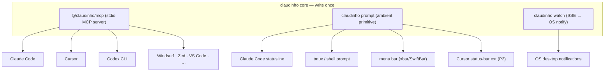
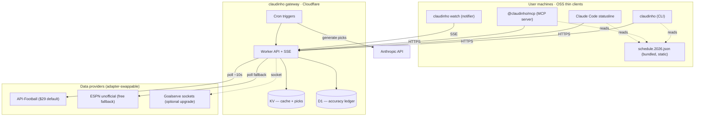
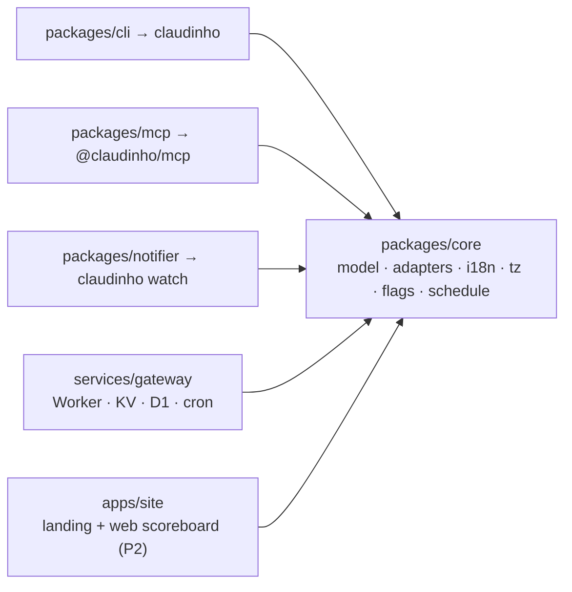
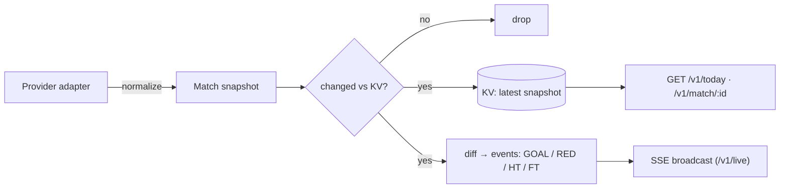
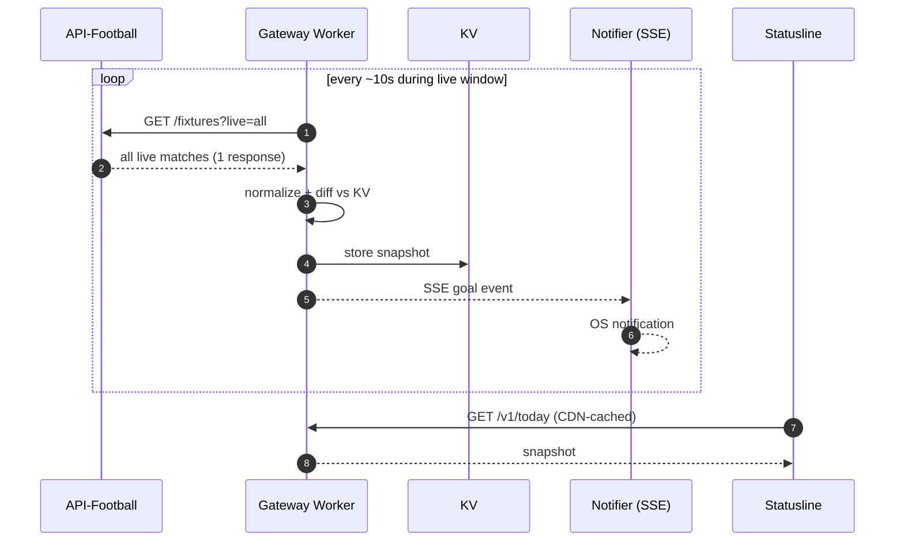
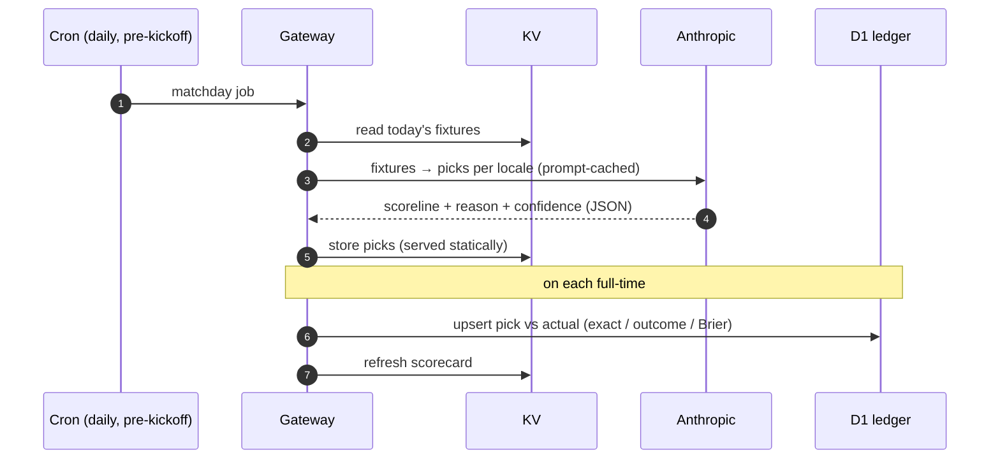
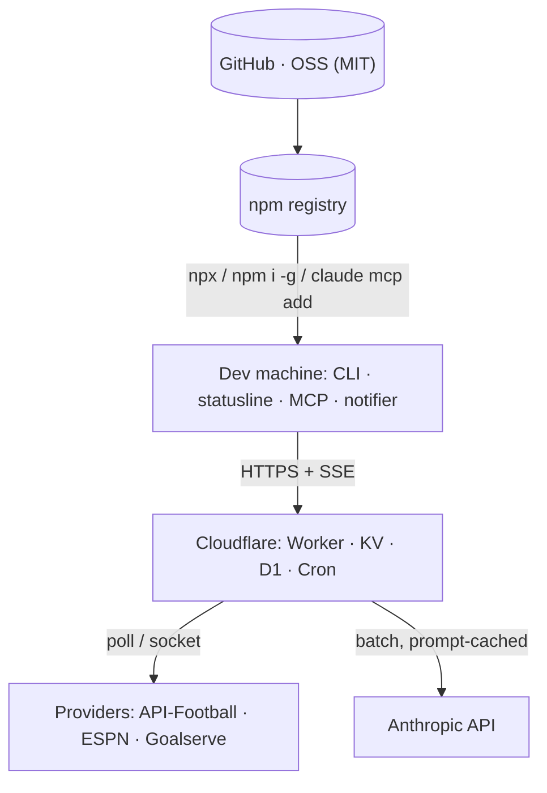
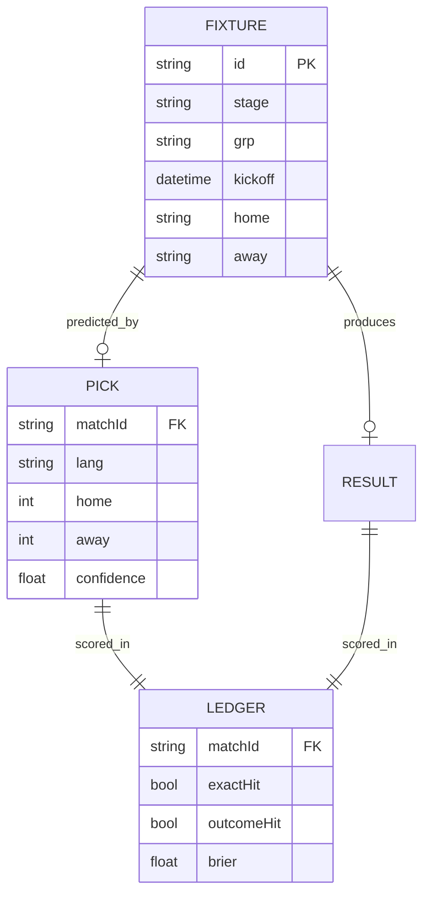

# PRD — `claudinho`: the World Cup, in your dev environment

| | |
|---|---|
| **Name** | **Claudinho** (brand / repo) · binary `claudinho` · packages `@claudinho/cli`, `@claudinho/mcp`, `@claudinho/core` |
| **Status** | Founding plan (v1). The hero shipped; market (0.3.0) & share (0.4.0) features are live on npm; gateway/notifier/pundit still planned. See "Status update" below. |
| **Author** | Arturo |
| **Date** | 2026-05-30 |
| **Target launch** | 2026-06-11 (tournament kickoff) — **12-day runway** |
| **Doc scope** | Product requirements + technical implementation overview + diagrams |

> **Naming notes.** Brand is **Claudinho** (Brazilian football diminutive — reads as *football* + *affectionate*). Binary is `claudinho` (independent of npm package name, so the squatted bare `claudinho` package is irrelevant). Ship under the **`@claudinho` npm scope** (`@claudinho/cli|mcp|core`); fallback to unscoped `claudinho-cli`/`claudinho-mcp` if the scope can't be claimed — same `claudinho` binary either way.
> **Marks to avoid:** keep "FIFA", "World Cup", the emblem/trophy/mascot out of branding (use "the 2026 tournament" descriptively). "Claude" is an **Anthropic** trademark and "Claudinho" derives from it — see §13/§16 for the implied-endorsement risk and mitigations. Do **not** ship a `wc` binary (collides with Unix `wc`).

---

> **Status update (2026-06-25).** **0.8.3** (pending) — bracket **group slots project from live standings mid-tournament** once a group has started (≥1 match played), with `(proj.)` flags for current leaders; slots stay TBD before kickoff or when standings are degraded. Builds on **0.8.2** (host R32 paths as group-winner topology refs). Prior snapshot follows.
>
> **Status update (2026-06-24).** Now at **0.8.0** (npm + provenance, MCP Registry `isLatest`) — the **knockout bracket** (PR #32): `claudinho bracket [--tree] [stage]` + `share bracket` + MCP `get_bracket`, the R32→Final tree ready for the Jun 28 Round of 32. Hybrid resolution (live FT winners incl. penalty shootouts, group projections from live standings once a group has started — marked `(proj.)`, 3rd-place TBD), **fails closed** on degraded data, en/es/pt/fr localized. Shipped after a heavy multi-round review (2 P1s incl. a penalty non-advancement bug + the winner-index keying, a P2 seed-leak, CI-blocking lint then typecheck — all fixed; see the launch memory + BACKLOG for the Jun-28 index-verify follow-up). Marketing dashboard remains canonical for growth status. Prior snapshots follow.
>
> **Status update (2026-06-23).** Now at **0.7.0** (npm + provenance, MCP Registry `isLatest`) — first minor since the Cursor wave, and the first post-launch *feature* PR from the maintainer. PR #31 shipped **knockout stage labels** (a shared core `stageLabel()` on match/next/share — MCP output now reads "Round of 32", making 0.7.0 MCP-affecting), **`CLAUDINHO_FLAGS` extended** to the interactive commands (today/live/table/next), and a **refreshed schedule** through the knockouts (R32 starts Jun 28). Review caught + the maintainer fixed a P2 (the regen had broken the "resultless skeleton" invariant; now enforced **defense-in-depth** via `sanitizeBundledFixture` + a fail-loud gen guard + a score-blind `rosterAtZero` degraded path). Marketing dashboard remains canonical for growth status. Prior snapshots follow.
>
> **Status update (2026-06-19).** Now at **0.6.2** (npm + provenance, MCP Registry `isLatest`). The milestone this release isn't a feature — it's the project's **first community contributor**: @alexviquez reported the repo's first issue (Warp rendering flag emoji as boxed letters) and landed its first merged PR (#27 — a `CLAUDINHO_FLAGS` 3-letter-code fallback with Warp auto-detect), reviewed + merged + shipped same-day; the auto-Release notes credit him under "New Contributors". Same night, **all Dependabot + security debt was cleared to zero** (esbuild advisory fixed, dev-deps current, `@types/node` majors pinned to the Node-20 floor, `actions/checkout`→v7) — 0 open PRs, 0 open alerts. Growth: the **Cursor-event LinkedIn post went live Jun 20** (`docs/cursor-push/linkedin-post.md`); the separate **first-contributor post** is queued for its own story. Marketing dashboard remains canonical for growth status. Prior snapshots follow.
>
> **Status update (2026-06-18).** Now at **0.6.1** (npm + provenance, MCP Registry). Since 0.5.0: 0.5.1 degraded-honesty across score/share surfaces, 0.5.2 live-match day-boundary fix, **0.6.0 Cursor CLI statusline**, and **0.6.1 the Cursor wave** — `init cursor`/`init claude` one-step setup, Cursor-first + Claude-parity READMEs, a **Cursor Marketplace plugin** (submitted; **cursor.directory listing + "Built for Cursor" forum post are LIVE**), and cursor/cursor-cli/cursor-agent/mcp/agent npm keywords. **Cursor is now a first-class surface alongside Claude Code** (statusline + MCP; the score-aware hook stays Claude-only — Cursor can't reliably inject hook context yet). Marketing dashboard remains canonical for growth status. Prior status snapshot follows.
>
> **Status update (2026-06-15).** Published at **0.5.0** (released Jun 14, npm + provenance, MCP Registry, Glama straight-A). v0.5.0 fixed a real bug where `table`/`get_standings` showed *wrong all-zero* standings mid-tournament (computed from a ±1-day match window over the resultless static schedule) by sourcing **authoritative cumulative standings** from the provider's standings feed (`adapter.fetchStandings` → core `getStandings`, fails closed to a degraded roster), and added **`share table <GROUP>`** (a standings card) + the Glama B→A MCP tool-description polish. Note: standings being correct still does NOT persist results — the **gateway** remains the home for a durable results history (see below). Growth status (the marketing plan's live dashboard is canonical): **9 stars**, all major MCP directories live or submitted, launch + Show HN + Product Hunt all spent; recalibrated targets are Jul 19: 50–80★. Original status follows.
>
> **Status update (2026-06-09).** The **hero shipped** and is live on npm (all three packages at **0.4.1**, with provenance): the **CLI** (`today`/`live`/`next`/`table`/`match` + `prompt`/`init-statusline`/`init-hook`), the **Claude Code statusline**, the score-aware **hook**, and the stdio **MCP server**. Two features landed *beyond* this PRD's original v1 scope: a read-only **prediction-market sidecar** (Polymarket odds — `claudinho markets` + MCP `get_market_signal`, **0.3.0**) and **shareable terminal snippets** (`claudinho share` + MCP `get_share_snippet`, **0.4.0**). Still **planned**: the edge **gateway**, the **notifier** daemon, and the **AI pundit** + scorecard — so anything below that depends on the gateway (live-via-SSE, persisted results, pundit) is not yet built; clients currently fetch live state directly from ESPN. A **VS Code/Cursor status-bar extension** is feasibility-reviewed and parked (`docs/VSCODE_CURSOR_STATUS_BAR_EXTENSION.md`). The body below is the founding plan, kept as-is for reference.

## 1. TL;DR

A free, open-source companion that surfaces the 2026 men's football tournament **where developers already live** — the terminal, Claude Code's statusline, and any MCP client — with **zero-friction install** and **near-real-time scores**. A small edge gateway polls a paid data feed **once for the entire world** and fans results out to thin, open-source clients, so it stays cheap at viral scale. A precomputed **AI pundit** makes public, accountable predictions with a running accuracy scorecard — the hook that makes it shareable and the bridge to a future consumer "you vs the AI" game.

**The viral artifact:** a screenshot of a live score ticking in your Claude Code statusline while you code, installed in one line.

---

## 2. Problem & opportunity

- During a month-long global event, developers context-switch to phones/tabs to check scores — breaking flow.
- Existing score apps are consumer mobile/web; **nothing lives natively in the dev environment** (terminal, Claude Code, MCP clients).
- MCP is new and hot; a genuinely useful, fun MCP server is rare and **eminently shareable in dev communities** (HN, X, r/commandline, awesome-mcp lists).
- The tournament is a **built-in, month-long distribution event** with a hard, well-known start date.

**Insight:** the scarce/expensive part is *low-latency live data*; everything else (schedule, groups, flags, fixtures) is **static and already final** post-draw. Centralize the expensive part behind a gateway, distribute the cheap part in the client, and the economics work at any scale.

---

## 3. Goals / Non-goals

### Goals
- **G1** One-command install for each surface (CLI, statusline, MCP, notifier).
- **G2** Ambient, near-real-time scores in the dev environment (goal → desktop ≤ 20s on the default feed).
- **G3** Cheap to run at viral scale (fixed upstream cost regardless of user count).
- **G4** Legally safe (facts + emoji flags only; no marks/likeness/footage).
- **G5** Localized (TZ-aware kickoffs; UI + pundit in en/es/pt/fr at launch).
- **G6** A fun, accountable AI-pundit hook with a public accuracy scorecard.

### Non-goals (v1)
- Accounts/auth, social graph, comments.
- Betting/odds, player-level stats, xG depth (provider-dependent; later).
- Mobile/web consumer app and the "you vs AI" pick'em game (**deliberate spin-off**, enabled by this PRD's pundit data).
- Video/highlights/audio.
- Non-tournament competitions (architecture leaves the door open).

---

## 4. Success metrics

**North star:** weekly active installs = unique clients pinging the gateway (CLI runs + statusline activations + MCP servers + notifiers).

| Category | Metric | Launch target (first 2 weeks) |
|---|---|---|
| Virality | GitHub stars | 1,000 |
| Virality | npm weekly downloads | 5,000 |
| Virality | MCP directory listings | 3+ (awesome-mcp, mcp.so, etc.) |
| Engagement | Statusline daily-active on match days | 2,000 |
| Engagement | Notifier opt-ins | 1,000 |
| Engagement | Pundit scorecard views | 10,000 |
| Quality | Goal latency p95 (event→notifier) | ≤ 20s |
| Quality | Gateway uptime | ≥ 99.9% |
| Quality | CLI crash-free runs | ≥ 99.5% |

---

## 5. Personas

- **Claude Code dev** — wants the score in the statusline without leaving the IDE; installs via `claude mcp add` / `claudinho init-statusline`.
- **Terminal native** — lives in tmux/Starship; wants `claudinho today`, `claudinho watch`, scriptable `--json`.
- **MCP tinkerer** — adds `@claudinho/mcp` to Claude Desktop/Cursor/Zed to ask the agent about matches mid-task.
- **Casual sharer** — installs for their country, screenshots the statusline, posts it. (Distribution engine.)

---

## 6. Product surfaces & functional requirements

Priorities: **P0** = must ship by kickoff · **P1** = fast-follow (by ~Jun 14) · **P2** = stretch.

### 6.1 CLI — `claudinho`
- **P0** `claudinho today` — today's fixtures (TZ-localized), live state inline.
- **P0** `claudinho live` — only in-progress matches, auto-refreshing (`--watch`).
- **P0** `claudinho next <TEAM>` — next fixture for a team, countdown in local time.
- **P0** `claudinho table [GROUP]` — group standings.
- **P0** `claudinho match <ID>` — single match detail (events: goals, cards).
- **P0** Global flags: `--json` (scripting), `--lang`, `--tz`, `--no-color`, `--source`.
- **P0** `claudinho init-statusline` — patches Claude Code `settings.json` (or prints snippet).
- **P0** `claudinho prompt` — emit one compact status line to stdout; the **universal ambient primitive** that feeds the Claude Code statusline, shell/tmux prompts, and menu-bar plugins (see §6.7).
- **P1** `claudinho install <client>` — print/apply MCP + ambient config for `claude | cursor | codex | tmux | starship`.
- **P1** `claudinho pundit [DATE]` — the AI's picks + reasoning.
- **P1** `claudinho scorecard` — AI accuracy to date.
- **P1** `claudinho watch [--team X]` — runs the notifier (see 6.4).

### 6.2 Claude Code statusline (the hero)
- **P0** Compact one-liner, e.g. `⚽ 🇲🇽 1–0 🇰🇷 67' · next 🇺🇸 in 3h`.
- **P0** Reads the gateway's cached snapshot via a tiny local micro-cache (≤ 5s TTL) so it's instant and never blocks the prompt.
- **P0** Configurable via env: `CLAUDINHO_TEAM`, `CLAUDINHO_LANG`, `CLAUDINHO_TZ`, `CLAUDINHO_COMPACT`.
- **P1** Pundit badge when idle (no live match): `🤖 7/12 ✓` (accuracy).
- **NFR**: must return in < 150ms (read-from-cache; never hit network on the hot path).
- **Note:** the statusline is Claude Code-specific; the Cursor / Codex / any-terminal equivalents are in §6.7, all built on the same `claudinho prompt` primitive.

### 6.3 MCP server — `@claudinho/mcp`
- **P0 Tools:** `get_today`, `get_live`, `get_match(id)`, `get_standings(group?)`, `get_next_fixture(team)`.
- **P1 Tools:** `get_pundit(date?)`, `get_scorecard`.
- **P0 Resources:** `standings://{group}`, `fixtures://{date}` (so the model can read tables as context).
- **P0 Prompts:** "Tournament today", "My team {TEAM}".
- **P0** Transport: stdio. One-line install: `claude mcp add claudinho -- npx -y @claudinho/mcp`.
- **P2** Server→client notifications/resource subscriptions for live push (client surfacing is unreliable — **not** the primary live channel; see 6.4).

### 6.4 Notifier daemon — `claudinho watch`
- **P1** Subscribes to the gateway SSE stream; fires **OS desktop notifications** on kickoff / goal / red card / HT / FT.
- **P1** `--team` filter; live-window-aware (only active during scheduled match windows derived from the static schedule); `--quiet-hours`.
- **NFR**: holds one SSE connection; goal → notification in (provider lag + ~1s).

### 6.5 AI pundit + accuracy (the shareable hook)
- **P1** Once per matchday, generate a **scoreline pick + one-line reason + confidence** per fixture, **per locale**, via the Anthropic API (batch, prompt-cached). Store statically.
- **P1** On full-time, score the pick vs actual: **exact-score hit**, **outcome hit (H/D/A)**, **Brier score**. Append to the accuracy ledger.
- **P1** Public **scorecard** endpoint + surfaces in CLI / MCP / statusline badge.
- **P2** Tone/persona for the pundit (bold, concise, a little cheeky — never offensive).

### 6.6 Edge gateway — `services/gateway`
- **P0** `GET /v1/today?lang&tz` · `GET /v1/match/:id` · `GET /v1/standings/:group` — cached JSON.
- **P0** `GET /v1/live` — **SSE** stream of normalized match-state diffs (goal/card/status).
- **P0** Provider polling with normalization, change-diffing, and **fallback** (API-Football → ESPN).
- **P1** `GET /v1/pundit?date&lang` · `GET /v1/scorecard` (+ daily cron generator and FT scorer).
- **NFR**: one upstream poll serves all clients; responses CDN-cached with short TTL.

### 6.7 Cross-client compatibility (Cursor, Codex CLI, any terminal)

**Core insight — MCP is write-once-run-everywhere.** `@claudinho/mcp` is a standard stdio MCP server, so the *same* package works in Claude Code, Cursor, Codex CLI, Claude Desktop, Windsurf, Zed, VS Code, and any other MCP client with **zero code changes**. Cross-client work is therefore **packaging + docs**, not new servers. The only per-tool *code* is the ambient "score-in-your-face" surface — and that collapses to one primitive (`claudinho prompt`) plus an optional Cursor extension.

**Compatibility matrix**

| Capability | Claude Code | Cursor | Codex CLI | Any terminal / OS |
|---|---|---|---|---|
| MCP tools/resources/prompts | ✓ `claude mcp add` | ✓ `.cursor/mcp.json` (+ 1-click deeplink) | ✓ `~/.codex/config.toml` / `codex mcp add` | — |
| Ambient score — GUI | statusline (P0) | status-bar extension (P2) | — (no native statusline) | menu-bar plugin xbar/SwiftBar (P2) |
| Ambient score — text | statusline | integrated terminal → `claudinho prompt` | shell prompt / tmux (P1) | shell prompt · tmux · terminal title (P1) |
| Live desktop notifications | `claudinho watch` | `claudinho watch` | `claudinho watch` | `claudinho watch` (P1) |
| Agent context file | `CLAUDE.md` | `AGENTS.md` / `.cursor/rules` | `AGENTS.md` | — |

**Install snippets** *(verify against current docs — these tools iterate fast)*

Cursor — `.cursor/mcp.json` (project) or `~/.cursor/mcp.json` (global):
```json
{ "mcpServers": { "claudinho": { "command": "npx", "args": ["-y", "@claudinho/mcp"] } } }
```
Ship a one-click **"Add to Cursor"** deeplink button in the README (`cursor://anysphere.cursor-deeplink/mcp/install?...`).

Codex CLI — `~/.codex/config.toml`:
```toml
[mcp_servers.claudinho]
command = "npx"
args = ["-y", "@claudinho/mcp"]
```
(or `codex mcp add claudinho -- npx -y @claudinho/mcp` on recent builds).

**The universal ambient unlock — `claudinho prompt`.** Codex CLI has no customizable statusline, and Cursor's isn't scriptable like Claude Code's. So instead of building N statuslines, expose **one** command that prints the compact status to stdout and wire it into surfaces that work *regardless of which agent is running*:
- **Claude Code statusline:** `statusLine.command = "claudinho prompt"`.
- **Shell prompt:** Starship `custom` command / oh-my-posh / powerlevel10k segment.
- **tmux:** `set -g status-right '#(claudinho prompt)'`.
- **Terminal title:** `claudinho watch --title` (OSC escape codes).
- **macOS menu bar:** xbar / SwiftBar plugin (script + refresh interval) — always-visible, app-agnostic.

This single primitive covers Codex, Cursor's integrated terminal, plain shells, tmux, and menu bars — so the "no statusline in Codex" gap disappears.

**Cursor status-bar extension (optional, P2).** Cursor is a VS Code fork, so a tiny extension using `window.createStatusBarItem()` gives a GUI status segment — the closest Cursor analog to the Claude Code statusline. Publish to the VS Code Marketplace + Open VSX. Optional, because Cursor users also have the integrated terminal (already covered by `claudinho prompt`).

**Context files (`AGENTS.md`).** Ship an `AGENTS.md` snippet (the open standard Codex / Cursor / others read) plus a `CLAUDE.md` snippet telling the agent the claudinho tools exist and when to call them — so agents proactively use `get_live` / `get_today` instead of guessing or web-searching.



---

## 7. Technical architecture

### 7.1 System context



### 7.2 Component / monorepo layout



```
claudinho/
├─ packages/
│  ├─ core/      # domain model, provider adapters, normalize, tz, emoji-flags, i18n, static schedule loader
│  ├─ cli/       # `claudinho` binary (commander) + statusline subcommand
│  ├─ mcp/       # `@claudinho/mcp` (@modelcontextprotocol/sdk, stdio)
│  └─ notifier/  # `claudinho watch` daemon (node-notifier + EventSource)
├─ services/
│  └─ gateway/   # Cloudflare Worker + KV + D1 + Cron Triggers + @anthropic-ai/sdk
├─ apps/
│  └─ site/      # Astro landing + web scoreboard (P2; SEO + shareable)
└─ data/
   └─ schedule.2026.json   # 104 fixtures, 12 groups, venues, kickoffs (static, final)
```

**Stack:** Node 20+, TypeScript, pnpm workspaces, tsup (build), vitest (test). CLI: `commander` + `picocolors` + `cli-table3`. MCP: `@modelcontextprotocol/sdk`. Notifier: `node-notifier` + `eventsource`. Gateway: Cloudflare Workers + KV + D1 + Cron Triggers; `@anthropic-ai/sdk` (prompt caching on). i18n: hand-rolled JSON dictionaries + `Intl.DisplayNames` (country names) + `Intl.DateTimeFormat` (TZ).

### 7.3 Data ingest & fan-out



### 7.4 Live score sequence (poll path)



> `GET /fixtures?live=all` returns **all** concurrent live matches in **one** request — so upstream quota scales with poll frequency, not match count or user count.

### 7.5 Pundit generation & accuracy scoring



### 7.6 Deployment topology



---

## 8. Data model

```ts
// Shared domain types (packages/core)
type Team = { code: string; name: string; flag: string };          // flag = emoji, e.g. "🇲🇽"
type Stage = 'GROUP' | 'R32' | 'R16' | 'QF' | 'SF' | 'F';
type Status = 'SCHEDULED' | 'LIVE' | 'HT' | 'FT' | 'POSTPONED' | 'CANCELLED';
type Outcome = 'H' | 'D' | 'A';

interface Match {
  id: string;               // stable id, mapped across providers
  stage: Stage;
  group?: string;           // 'A'..'L' for group stage
  kickoff: string;          // ISO 8601 UTC
  venue: string;
  home: Team; away: Team;
  score?: { home: number; away: number };
  minute?: number;
  status: Status;
  events?: MatchEvent[];     // goals, cards (provider-dependent)
  updatedAt: string;         // ISO; for diffing/cache
}

interface MatchEvent { type: 'GOAL'|'OWN_GOAL'|'PEN'|'YELLOW'|'RED'|'SUB'; minute: number; teamCode: string; player?: string; }

interface PunditPick {
  matchId: string; lang: string;
  scoreline: { home: number; away: number };
  outcome: Outcome;
  reason: string;            // one line, localized
  confidence: number;        // 0..1
  createdAt: string;
}

interface LedgerRow {
  matchId: string;
  predicted: { home: number; away: number; outcome: Outcome };
  actual:    { home: number; away: number; outcome: Outcome };
  exactHit: boolean; outcomeHit: boolean; brier: number;
}
```

Provider abstraction (the swap-point that keeps the data vendor a one-module decision):

```ts
interface ProviderAdapter {
  name: string;
  capabilities: { push: boolean; latencyHintSec: number };
  fetchByDate(dateISO: string): Promise<Match[]>;   // schedule/results
  fetchLive(): Promise<Match[]>;                     // poll path (e.g. live=all)
  subscribe?(onBatch: (m: Match[]) => void): () => void; // push path (Goalserve)
}
```

Accuracy store (D1):



---

## 9. Data sources & provider strategy

| Provider | Event→feed | Delivery | WC 2026 | Price | Role |
|---|---|---|---|---|---|
| **API-Football** | ~15s | REST poll (`live=all` = 1 call) | ✓ | $19/$29/$39 mo | **Default (paid)** |
| ESPN (unofficial) | ~30–60s | REST poll, no key | ✓ | free | **Fallback / offline BYO** |
| football-data.org | minutes | REST poll, 10/min | ✓ free | free | last-resort fallback |
| Goalserve | 1–5s (sockets <1s) | **WebSocket push** | ✓ | ~$200/mo | **Optional upgrade** if speed becomes the brand |
| Sportradar / Opta / Genius | sub-second, official | WS/push | ✓ | sales-gated $$$$ | out of scope |

- **Default buy:** API-Football Ultra ($29/mo) behind the gateway, ESPN as automatic fallback.
- **Static-first:** schedule/groups/venues/kickoffs ship as `schedule.2026.json` (final post-draw); only live state needs the feed.
- **Power-user direct mode:** CLI/MCP can run against ESPN (no key) or a user's own API-Football key, bypassing the gateway entirely (privacy/offline). Selected via `--source` / env.
- **ToS:** serve only normalized **facts** with attribution; verify any single provider's redistribution terms before hard-caching; the adapter makes swapping trivial.

---

## 10. Non-functional requirements

- **Latency:** goal→notifier p95 ≤ 20s (API-Football) / ≤ 5s (Goalserve). Statusline reflects within its own refresh cadence (reads cache, never blocks).
- **Scalability:** upstream cost independent of user count (gateway polls once). SSE fan-out via Cloudflare; escalate to **Durable Objects** pub/sub if concurrent SSE connections get large.
- **Availability:** gateway ≥ 99.9%; graceful degradation → static schedule + last-known score on provider/gateway failure.
- **Cost ceiling:** < $150 for the whole tournament (see §11).
- **Security/privacy:** no PII, no accounts in v1. **API keys live only on the gateway**, never in shipped clients. Clients talk only to the gateway (no user key required) → zero friction.
- **Localization:** see §12. **Accessibility:** `--no-color` / `NO_COLOR`; statusline is plain text; notifier respects OS settings.
- **Install:** one command per surface; CLI cold start < 2s.

---

## 11. Scalability & cost model

**Upstream quota (API-Football, `live=all` = 1 call/poll):**
- Poll every 10s × ~12h live window ≈ **~4,300 calls/day** → fits **Pro ($19, 7,500/day)**; **Ultra ($29, 75k/day)** leaves ample headroom for retries + schedule/standings calls.
- **Independent of user count** — 10 users or 10M, same upstream load.

**Anthropic (pundit):** ~104 matches × ~4 locales × 1 short generation, prompt-cached → **< $20 total** for the tournament.

**Cloudflare:** Workers + KV + D1 within free/low tiers at hobby scale; ~$5/mo Workers Paid if needed. CDN caching absorbs read spikes.

| Item | Tournament cost (≈2 months) |
|---|---|
| API-Football Ultra | ~$58 |
| Anthropic (pundit) | < $20 |
| Cloudflare | $0–$10 |
| **Total** | **~$80–90** |

Upgrade lever: swap default adapter to **Goalserve sockets (~$200/mo)** only if "fastest goals" becomes the headline — no rewrite (adapter pattern).

---

## 12. Localization

- **Emoji flags** (🇲🇽) — zero assets, no copyright, render everywhere.
- **TZ-aware kickoffs** via `Intl.DateTimeFormat` (system TZ default; `--tz`/`CLAUDINHO_TZ` override). "When does my team play in *my* time" is the #1 UX win.
- **Country names** via `Intl.DisplayNames`; **UI strings** in JSON dictionaries.
- **Launch locales:** en, es, pt, fr (host nations + LatAm; Spanish is critical for the Mexico opener). Community-contributable.
- **Pundit text** generated per-locale in the cron.

---

## 13. Legal / compliance

- **Dual disclaimer** — *"Not affiliated with or endorsed by FIFA or Anthropic"* — in README + `claudinho --version` + MCP server description. Covers both the tournament marks and the Anthropic-derived name.
- **Name/trademark posture:** "Claudinho" derives from Anthropic's "Claude" mark. Mitigate via (a) the disclaimer, (b) unmistakably community/fan framing, (c) MIT license, (d) never using Anthropic's or FIFA's logos/wordmarks/emblems in branding. Be ready to rename to a fallback if Anthropic objects — the binary/scope indirection keeps that cheap.
- **Facts + emoji flags only.** No player photos/likenesses, club/national crests, kits, or broadcast footage.
- Attribute the data provider per its ToS; respect rate limits; verify redistribution terms before hard-caching any single source.
- **MIT-license** the clients (dev trust + virality). Gateway source can be public too (keys in secrets).

---

## 14. Milestones (12-day runway → kickoff)

| Days | Dates | Deliverable | Priority |
|---|---|---|---|
| 1–2 | May 30–31 | Scaffold monorepo; `schedule.2026.json`; core model + adapter iface; API-Football + ESPN adapters; **smoke-test ESPN/API-Football for WC 2026** | P0 |
| 3–4 | Jun 1–2 | CLI (`today/live/next/table/match`); emoji flags; TZ; i18n en/es | P0 |
| 5 | Jun 3 | **Statusline hero** + README/GIF; gateway skeleton (score cache + `/v1/today`) | P0 |
| 6–7 | Jun 4–5 | MCP server (tools/resources/prompts); install one-liners for **Claude Code + Cursor + Codex**; `claudinho prompt` primitive; `AGENTS.md`/`CLAUDE.md` snippets; publish to npm | P0 |
| 8 | Jun 6 | Notifier daemon (`/v1/live` SSE + node-notifier); tmux/Starship/menu-bar recipes | P1 |
| 9–10 | Jun 7–8 | Pundit cron + accuracy ledger + endpoints; surface in CLI/MCP/statusline; localize pundit | P1 |
| 11 | Jun 9 | Polish: provider fallback, rate-limit guards, error states, docs, landing page | P0 |
| 12 | Jun 10 | Buffer; soft-launch to awesome-mcp lists; prep Show HN | — |
| 🏁 | **Jun 11** | **Launch** (Show HN / X / r/commandline) timed to the opening match | — |

**Cut-line:** the **hero (CLI + statusline + MCP)** must ship by kickoff; **notifier + pundit** are fast-follows by ~Jun 14. Cross-client MCP install (Cursor/Codex) is ~free and ships with the hero; the **Cursor status-bar extension** and **menu-bar plugin** are P2 fast-follows. The tournament runs to Jul 19 — a month of runway to iterate.

---

## 15. Launch & growth

- **Artifact:** GIF/screenshot of a live score in the Claude Code statusline while coding. One-line install in the first line of every post.
- **Channels:** Show HN ("World Cup in your terminal / Claude Code statusline"), X dev community, r/commandline, MCP directories (awesome-mcp, mcp.so), Claude community.
- **Built-in hook:** the tournament is a month-long news engine; the pundit scorecard is a recurring story ("the AI is 9/14 — can you beat it?").
- **Share affordance:** `claudinho share` emits a copyable emoji score card → seeds the future consumer pick'em.

---

## 16. Risks & mitigations

| Risk | Likelihood | Impact | Mitigation |
|---|---|---|---|
| ESPN unofficial endpoint breaks/changes | Med | Med | API-Football is primary; ESPN only fallback; monitoring + alert |
| Provider latency worse than hoped | Med | Med | Goalserve sockets upgrade path (adapter swap) |
| MCP clients don't surface live push | High | Low | Notifier daemon (SSE) is the real live channel, not MCP push |
| Cloudflare SSE fan-out at viral scale | Low | Med | Durable Objects pub/sub; statusline uses cached GET, not SSE |
| Timeline slip | Med | High | P0/P1 cut-lines; hero ships first; pundit/notifier fast-follow |
| Legal — FIFA marks/likeness | Low | High | No marks/crests/kits/footage/faces; facts + emoji flags only; disclaimer |
| Legal — "Claudinho" leans on Anthropic's "Claude" mark | Low-Med | Med-High | Dual disclaimer; fan/community framing; MIT; no Anthropic logo; rename-ready (scope + binary indirection) |
| Data ToS / redistribution | Med | Med | Serve normalized facts + attribution; verify terms; adapter swap |

---

## 17. Open questions

1. Final product name (clear of marks).
2. Locales beyond en/es/pt/fr at launch?
3. Goalserve upgrade — pre-commit for the knockout rounds, or only if "fastest" trends?
4. Ship the web scoreboard (`apps/site`) at launch for SEO/shareability, or post-kickoff?
5. Pundit persona/tone and whether to name it.
6. When to introduce handle-based "you vs AI" leaderboard (the spin-off trigger).

---

## 18. Appendix — install UX (target)

```bash
# MCP (Claude Code) — also works in Cursor (.cursor/mcp.json) & Codex (~/.codex/config.toml)
claude mcp add claudinho -- npx -y @claudinho/mcp

# CLI  (installs the `claudinho` binary; bare `claudinho` pkg is squatted, so use the scope)
npm i -g @claudinho/cli   # or: npx @claudinho/cli today
claudinho next MEX --tz America/Mexico_City

# Statusline (Claude Code)
claudinho init-statusline   # patches ~/.claude/settings.json, or prints the snippet

# Notifier
claudinho watch --team MEX
```

Example statusline output:

```
⚽ 🇲🇽 1–0 🇰🇷 67'  ·  🇧🇷 vs 🇷🇸 in 2h10m  ·  🤖 7/12 ✓
```
